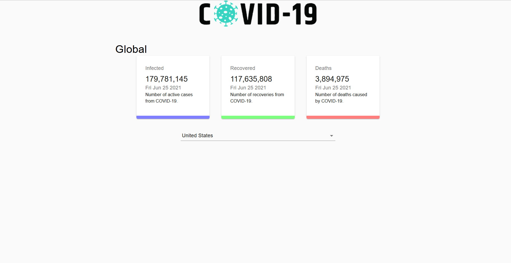

# covid19track
In this project I've use this <a href="https://covid19.mathdro.id/api">API</a> to fetch the data and simple provided it to my component of react-App  
    

    
Live Deployment: <a href="https://ritikkr.github.io/covid19track/" style=":hover{color:red}">https://ritikkr.github.io/covid19track/</a>
